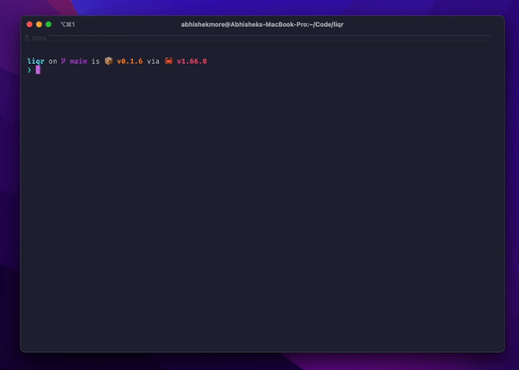

# LiQR CLI

Have you ever used your phone or tablet to access a web app running on live-server?\
If so, you probably went through the tedious process of:

* Figuring out your local IP
* Typing it into your mobile browser
* Realizing you made a mistake
* Typing it into your mobile browser again
* Finally accessing your app

LiQR (pronounced 'liquor') fixes this problem by generating a QR code in your terminal that links to your live server.



## Installation
Install using cargo:
```
cargo install liqr
```

## Usage

To generate a QR code at [local_ip]:[port]:
```
liqr [port]
```
The default port is 5500
Example: `liqr 3000` &rarr; https://localhost:3000
<br>
<br>

To create a QR code for [local_ip]:[port][route]:
```
liqr [port] -r [route]
```
Example: `liqr 3000 -r /api/users` &rarr; https://localhost:3000/api/users
<br>
<br>

To create a general QR code for [url]:
```
liqr -u [url]
``` 
Example: `liqr -u https://google.com` &rarr; https://google.com
